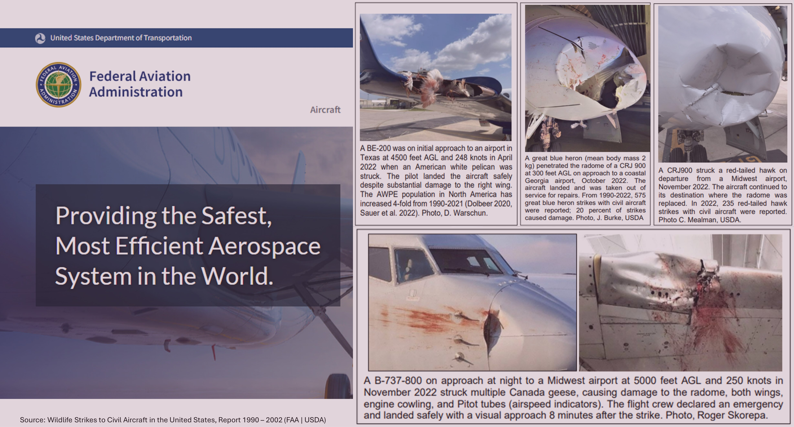
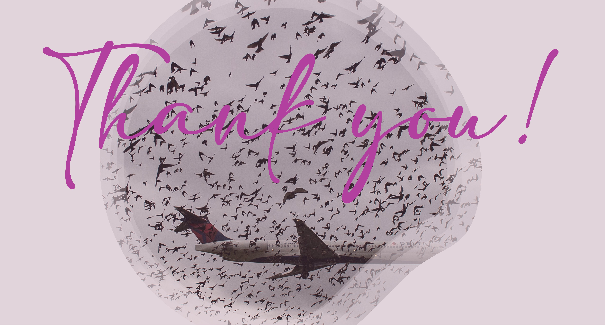

# Final-Project-Tableau
This is the final Tableau project for my LHL Data Analytics. For this project, I selected Option 2: Creating Your Own Question and Dashboard.

I chose the [**FAA WIldlife Strikes, 2015**](https://drive.google.com/drive/folders/1A02_9D5_sbLyrjnaDDiOEUvDY5qzKGJt?usp=sharing) dataset which contains records of wildlife strikes reported by airlines, airports, pilots and other sources to the Federal Aviation Administration (FAA).

## Project/Goals
After some research to understand the subject matter (figure below), I decided to explore the occurence and frequency of strikes, spread by locations, cost (monetary and otherwise) as well as the major wildlife hazards in order to provide recommendations for hazard mitigation.

## Process
### Data Connection & Exploration
The dataset was connected to the Tableau software, observations of data types (dimensions, measures, geographical points, fields and their meanings) and exploratory analysis was carried out to understand the data and the best ways to visualize them.

### Visualizations and Trend Observation
Visualizations used to explore the data included:
- Highlight Tables
- Maps
- Stacked and Side-by-side bars
- Line graphs
- Packed bubbles
- Scatter Plots

## Results
Choice: Option 2: FAA Wildlife Strikes
Data Analysis: Exploring the seasonality of the strikes, the economic cost/effect and the main wildlife hazards influencing the strikes and damages.

#### Visualizations created and Observations: 
- The number of strikes resulting in damages was significantly less than the number resulting in no damages.

- However, the economic cost over time, in dollars and in hours in which the aircraft was out of service, was significant,

 

 And widespread across the US states:

 

- Overall, birds were the most commonly-struck species and their strike accounted for most of the damages to aircraft, for non-bird species, the most commonly struck category was deer and elks.

- Morning doves are the most common wildlife species struck by aircraft in US, however they account for a low percent of the damages, however Canada geese which account for about 5% of the strikes are responsible for most of the strikes causing significant damages.

- Seasonality can be observed in the pattern of bird strikes. More than half of the strikes occur from July to October each year which is when young birds have fledged from nests and when fall migration occurs.

## Challenges 
My main challenge during this project was time constraint and occasional crashes of Tableau but overall, it was an interesting subject matter.

## Future Goals
I would make my dashboards more intuitive and interactive for ease of use if I had more time and would love to do a comparative analysis after wildlife management measures are implemented.

